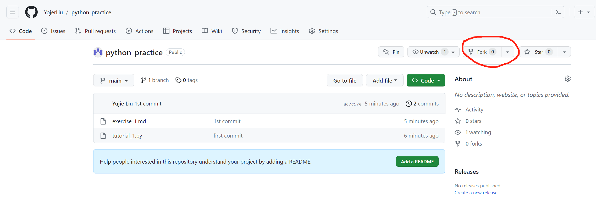
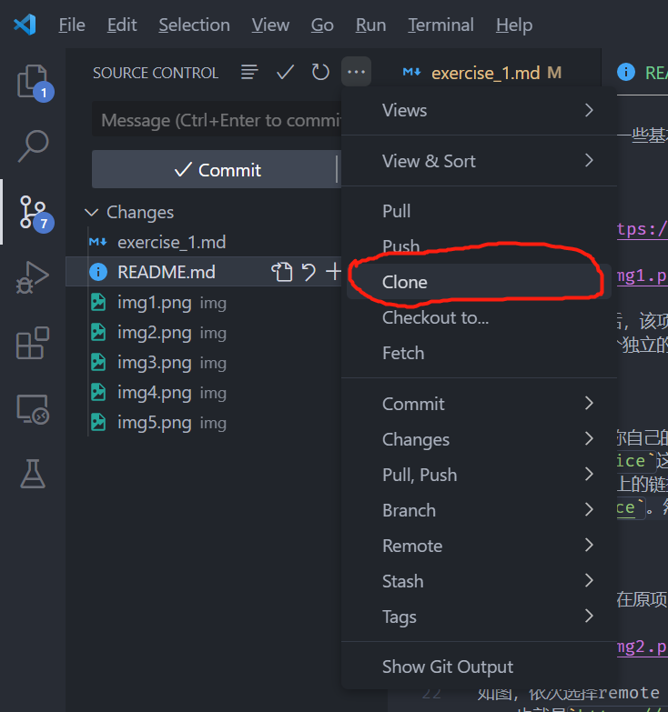
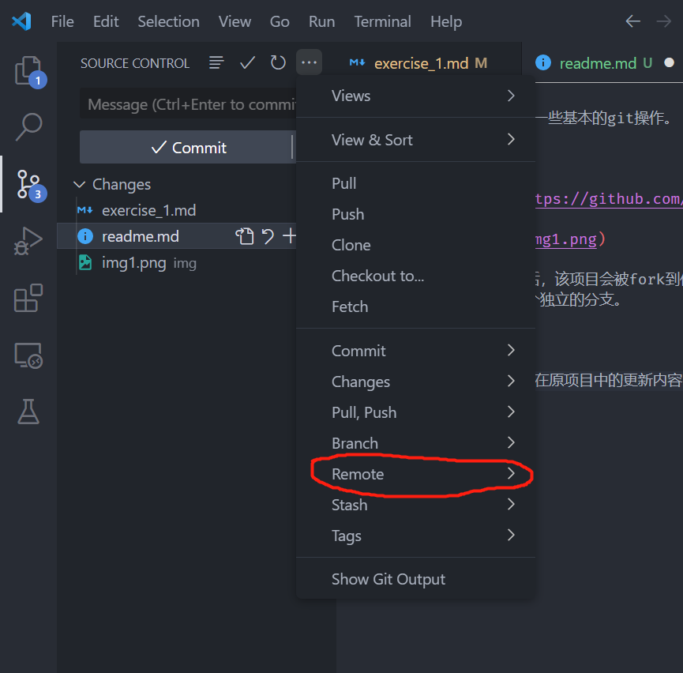
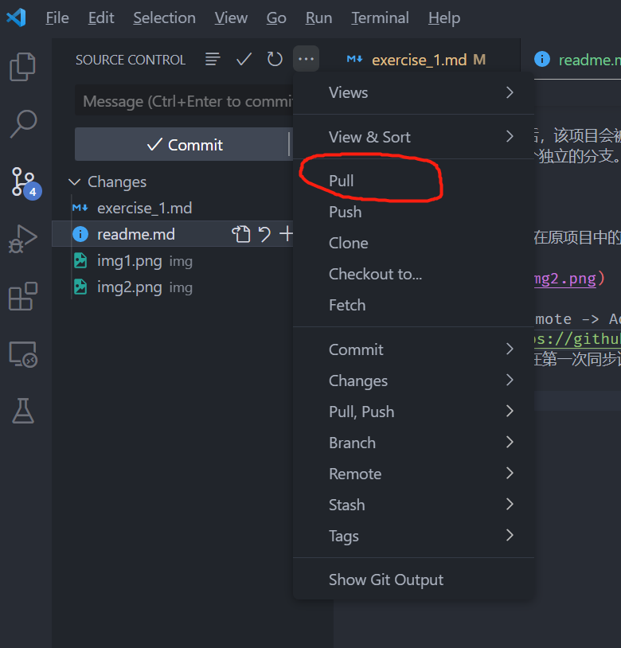
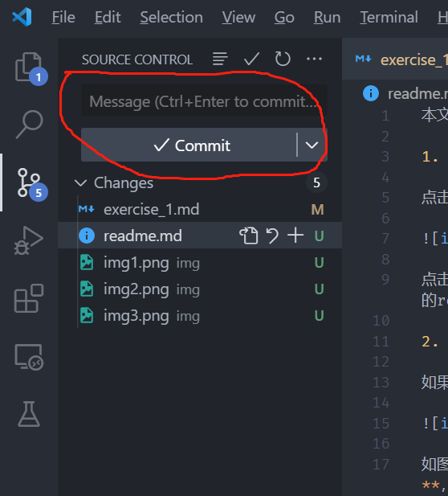

本文档仅用于说明一些基本的git操作。

1. git fork

点击此[链接](https://github.com/YojerLiu/python_practice)，会进入如下页面：

点击fork，成功后，该项目会被fork到你自己的github repo中，相当于是Yojer创建的项目在你的repo中有了一个独立的分支。

2. git clone

在github上点击你自己的头像，再点击`Your repositories`。你会发现自己的仓库中多了`python_practice`这个项目。唯一不同的是，现在这个项目相当于Yojer创建的项目的影分身。
复制浏览器地址栏上的链接，类似：`https://github.com/Ketchupong/python_practice`。然后打开vscode，接下来的操作如图所示：

点击clone，在上方弹出的对话框中粘贴刚刚复制好的链接，然后回车。根据提示将项目文件夹放在你指定的目录。然后在vscode中打开该项目。

3. git pull

如果需要将Yojer在原项目中所更新的内容同步到你自己的分支中，就需要使用git pull操作。

如图，依次选择remote -> Add Remote，在上方弹出的对话框里输入Yojer创建的**原项目地址**，也就是`https://github.com/YojerLiu/python_practice`，然后按回车。（Add remote这一步仅在第一次同步该项目时需要，以后就不需要了，除非需要修改远程同步的地址）

点击pull。这时Yojer在原始仓库所更新的内容会被下拉到本地，并与你自己在本地做的修改（如果有的话）进行合并。

3. git commit

Changes一栏下面出现的都是有所改动的文档，包括你自己所做的改动以及从Yojer的原仓库pull下来的改动。为了将这些变动同步到你远程的github repo，需要先commit，也就是提交这些改动。红圈部分的Message一栏用于填写commit信息，这一行可以填写任意内容，例如`1st version`, `Just some modifications`，但不能空着。填好commit信息后，需要点击红圈中的Commit按钮以提交这些变动。点击commit之后vscode可能会弹出一个对话框询问你是否要提交unstaged变动，点yes确认就好。

4. git push

在commit之后，点击push。这样，所有的变动都被更新到你自己的仓库，你可以在github上检查自己的仓库，可以发现所有更新都已被同步。